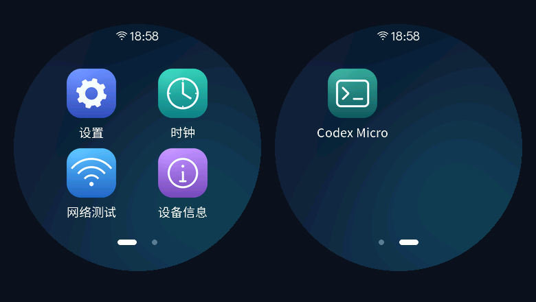

# Waveshare 1.85B 应用桌面

适用于 **ESP32-S3-Touch-LCD-1.85B 原板**。开机进入中文应用桌面，设置、时钟、网络测试、设备信息和 Codex Micro 共用 Wi-Fi 与蓝牙服务。

## 渲染图



360 × 360 圆屏的 LVGL 渲染预览。

## 编译与烧录

准备 Windows、Python 和 Docker Desktop（Linux 容器），USB 连接开发板后，在项目根目录运行：

```powershell
python -m pip install esptool==4.11.0
./scripts/build.ps1
./scripts/flash.ps1 -Port COM5
```

将 `COM5` 换成开发板实际端口。构建使用 ESP-IDF 5.5.3，固件输出到 `dist/`。烧录失败时按住 BOOT 再复位，松开 BOOT 后重试。

烧录脚本分别写入引导程序、分区表和应用，升级本项目时保留配网及配对。使用 Flash Download Tool 时，可将 `dist/waveshare-launcher-usb.bin` 烧录至 `0x0`，选择 ESP32-S3、DIO、80 MHz、16 MB；合并固件会重置已保存的设置。

## 应用使用

桌面左右滑动翻页，点击图标进入；应用内点击“返回”或从屏幕底部上滑回桌面。

| 应用 | 使用方式 |
| --- | --- |
| 设置 | 扫描并连接 2.4 GHz Wi-Fi，调整亮度，开启蓝牙或重新配对；联网后所有应用共用连接。 |
| 时钟 | 联网后自动同步北京时间。 |
| 网络测试 | 检查 DNS、校时和 HTTPS，显示响应码与耗时。 |
| 设备信息 | 查看电量、电压、电流、功率、温度和容量；上滑查看更多读数及板卡信息。 |
| Codex Micro | 显示 Codex 额度与像素表盘，提供智能体选择、Send、方向和 BOOT 语音控制。 |

使用额度表盘时，在设置中开启蓝牙，电脑配对 **Codex Micro**，再运行 `scripts/companion/start-companion.cmd`。同步配置见 [伴生程序说明](scripts/companion/README.md)。

## 额度表盘

[Codex Micro 1.85B](https://github.com/linyuww/codex-micro-1.85b)：额度表盘、电脑端同步及控制的独立项目。

## 开源协议

本项目新增代码采用 [MIT License](LICENSE)。导入的 Codex Micro 保留其 [MIT 协议](firmware/components/codex_micro/LICENSE)，第三方组件遵循各自协议；中文字库采用 [SIL Open Font License 1.1](docs/FONT-LICENSE.txt)。
